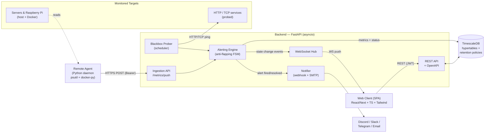
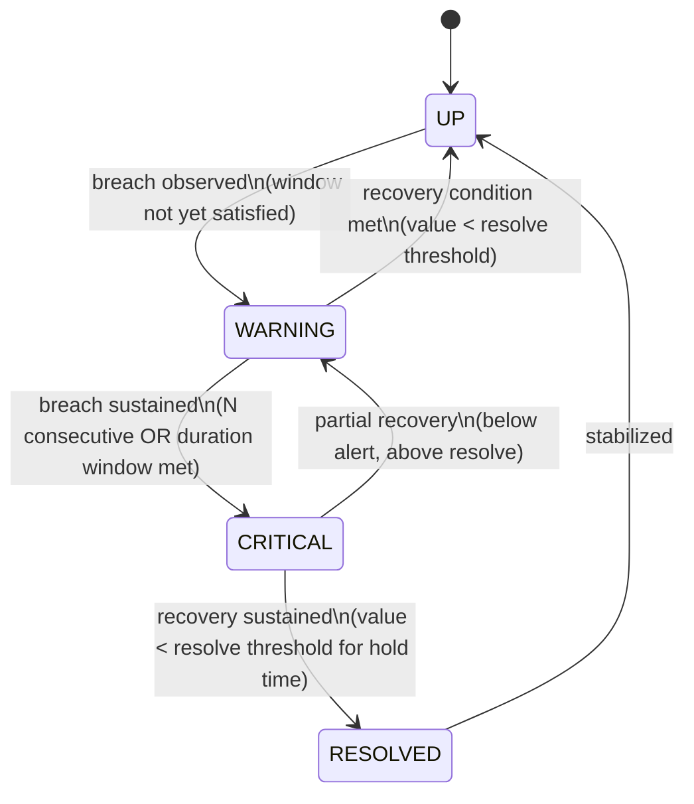
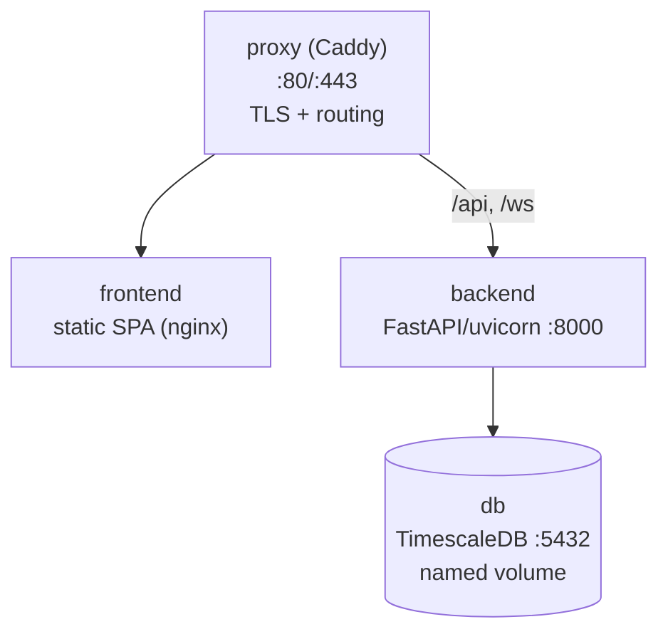

# Lookout — Architecture

> Single source of truth for developers (human and AI) implementing Lookout.
> Derived from `requirements.md`. Keep this document and the code in sync; if the
> implementation diverges, append an addendum section rather than silently editing the prose.

---

## 1. Overview

**Lookout** is a self-hosted, zero-configuration monitoring and alerting platform for small
infrastructures (a handful of servers, containers, and public APIs). It collects health data
through **two paradigms** — *pull* (the backend actively probes HTTP/TCP targets, "blackbox")
and *push* (lightweight agents report host metrics, "whitebox") — stores everything as time
series in **TimescaleDB**, and runs an **anti-flapping alerting engine** that suppresses noise
from micro-interruptions and threshold oscillation. State changes are streamed to a
**cyberpunk/HUD dashboard** over WebSockets in real time. The entire stack ships as a single
`docker compose up -d`.

**Design philosophy:**
- **Domain-first / hexagonal.** The alerting state machine and metric model are pure Python with
  zero framework or I/O imports. FastAPI, TimescaleDB, HTTP probing, and notification channels are
  *adapters* plugged into *ports*. This keeps the business-critical anti-flapping logic trivially
  unit-testable.
- **Async by default.** Probing, ingestion, persistence, and WebSocket fan-out are all `asyncio`.
- **Zero-config UX.** A monitored service auto-generates its dashboard panel the moment it is
  detected; users never hand-build charts.
- **Bounded resource use.** Aggressive TimescaleDB retention guarantees the DB never fills the disk.

---

## 2. High-Level Architecture



**Communication summary**

| From | To | Transport | Auth |
|---|---|---|---|
| Remote Agent | Backend `/api/v1/metrics/push` | HTTPS POST (JSON) | Static Bearer API key |
| Backend Prober | HTTP/TCP targets | HTTP/TCP outbound | n/a |
| Backend | TimescaleDB | SQL (asyncpg) | DB credentials (env) |
| Backend | Web Client | WebSocket push + REST | JWT (UI) |
| Backend | Notification channels | Outbound HTTPS / SMTP | Per-channel secrets |

---

## 3. Component Breakdown

### 3.1 Remote Agent (`agent/`)

- **Role:** Whitebox collector. Runs as a daemon on each monitored host (classic server or
  constrained device like a Raspberry Pi) and pushes host metrics to the backend.
- **Key responsibilities:**
  - Sample CPU, RAM, disk usage via `psutil`.
  - Enumerate Docker containers and their statuses via `docker-py` (optional; degrades gracefully
    if no Docker socket present).
  - Batch metrics into a single JSON payload and `POST` to `/api/v1/metrics/push` on a fixed
    interval (configurable, default 15s).
  - Authenticate every request with a static Bearer API key.
  - Be resilient: local retry/backoff buffer if the backend is unreachable; minimal memory/CPU
    footprint.
- **Technology:** Python 3.11+, `psutil`, `docker` (docker-py), `httpx`, `pydantic` for payload
  modeling. Packaged as a tiny standalone container or a `pip install`-able script.
- **Module structure:**
  ```
  agent/
  ├── lookout_agent/
  │   ├── __main__.py          # daemon entrypoint / run loop
  │   ├── config.py            # env-driven config (API URL, key, interval) + validation
  │   ├── collectors/
  │   │   ├── system.py        # psutil: cpu, mem, disk
  │   │   └── containers.py    # docker-py: container list + states
  │   ├── transport.py         # httpx client, batching, retry/backoff
  │   └── models.py            # pydantic MetricBatch payload (shared shape with backend)
  ├── tests/
  ├── pyproject.toml
  └── Dockerfile
  ```

### 3.2 Backend — FastAPI (`backend/`)

- **Role:** The central server. Probe scheduler, ingestion endpoint, anti-flapping rules engine,
  persistence orchestrator, REST API, and WebSocket hub.
- **Key responsibilities:**
  - **Pull/blackbox scheduler:** periodically probe configured HTTP/TCP targets, measuring latency
    and validating status codes.
  - **Push/whitebox ingestion:** accept and validate agent payloads, rate-limited.
  - **Alerting engine:** feed every observation into the per-service state machine; emit state
    transitions and fire/resolve notifications.
  - **Persistence:** write raw metrics, service status, and alert history to TimescaleDB.
  - **REST API:** service config, status listing, alert test — with auto-generated OpenAPI docs.
  - **WebSocket hub:** broadcast consolidated infrastructure state to connected dashboards.
  - **Notifier:** deliver alerts to webhooks (Discord/Slack/Telegram) and SMTP email.
- **Technology:** Python 3.11+, FastAPI, `uvicorn`, `asyncpg` (or SQLAlchemy 2.x async), `httpx`,
  `pydantic` v2, `python-jose`/`pyjwt` for JWT, `slowapi` (or custom) for rate limiting,
  `apscheduler` or a native asyncio task loop for the prober.
- **Architecture (hexagonal):** `domain` is pure; `application` orchestrates use cases;
  `infrastructure` holds all adapters (HTTP, DB, scheduler, notifiers). Dependencies point inward only.
- **Module structure:**
  ```
  backend/
  ├── app/
  │   ├── main.py                      # FastAPI app factory, lifespan, DI wiring, graceful shutdown
  │   ├── config.py                    # Settings (pydantic-settings), env validation
  │   │
  │   ├── domain/                      # PURE — no FastAPI / no DB / no I/O imports
  │   │   ├── models.py                # Service, Metric, Observation, Alert, ServiceState (enum)
  │   │   ├── alerting/
  │   │   │   ├── state_machine.py     # anti-flapping FSM (see §6)
  │   │   │   ├── thresholds.py        # threshold + hysteresis value objects
  │   │   │   └── sliding_window.py    # consecutive-failure / duration window logic
  │   │   └── ports/                   # interfaces (ABCs / Protocols)
  │   │       ├── metric_repository.py
  │   │       ├── service_repository.py
  │   │       ├── alert_repository.py
  │   │       ├── notifier.py
  │   │       └── event_publisher.py   # for WS broadcast
  │   │
  │   ├── application/                 # use cases / orchestration
  │   │   ├── ingest_push_metrics.py
  │   │   ├── run_blackbox_probe.py
  │   │   ├── evaluate_alerts.py       # drives the FSM, persists, publishes, notifies
  │   │   ├── list_service_status.py
  │   │   ├── register_service.py
  │   │   └── send_test_alert.py
  │   │
  │   ├── infrastructure/              # adapters implementing the ports
  │   │   ├── db/
  │   │   │   ├── session.py           # async engine / pool
  │   │   │   ├── repositories/        # Timescale-backed repo implementations
  │   │   │   └── migrations/          # Alembic migrations + hypertable/retention setup
  │   │   ├── prober/
  │   │   │   ├── scheduler.py         # periodic task loop
  │   │   │   └── http_tcp_prober.py   # httpx / asyncio TCP probes
  │   │   ├── notifiers/
  │   │   │   ├── webhook_discord.py
  │   │   │   ├── webhook_slack.py
  │   │   │   ├── webhook_telegram.py
  │   │   │   └── smtp_email.py
  │   │   └── ws/
  │   │       └── hub.py               # connection registry + broadcast (event_publisher impl)
  │   │
  │   ├── api/                         # FastAPI routers (thin — no business logic)
  │   │   ├── deps.py                  # DI providers, auth dependencies
  │   │   ├── v1/
  │   │   │   ├── metrics.py           # POST /metrics/push
  │   │   │   ├── services.py          # GET /services/status, POST /config/services
  │   │   │   ├── alerts.py            # POST /alerts/test
  │   │   │   ├── auth.py              # login, token refresh
  │   │   │   └── ws.py                # WS /ws/v1/dashboard
  │   │   └── errors.py                # custom exceptions + global handler
  │   └── schemas/                     # pydantic request/response DTOs
  ├── tests/
  │   ├── unit/                        # domain (FSM, windows, hysteresis)
  │   ├── integration/                 # API + DB
  │   └── conftest.py
  ├── alembic.ini
  ├── pyproject.toml
  └── Dockerfile
  ```

### 3.3 Database — TimescaleDB (`backend/app/infrastructure/db/`)

- **Role:** Single persistent store for both relational data (users, service configs, alerts) and
  time-series data (metrics). Provides time indexing and automatic retention.
- **Key responsibilities:**
  - Store raw metrics as **hypertables** partitioned by time.
  - Continuous aggregates roll raw metrics into coarser buckets after 24h.
  - Retention policies drop raw metrics older than 7 days.
  - Serve fast time-range queries for status and dashboard panels.
- **Technology:** TimescaleDB (PostgreSQL 16 + timescaledb extension), accessed async via
  `asyncpg`. Schema/migrations via Alembic; hypertable + policy creation in migration scripts.
- **Schema:** see §9.

### 3.4 Frontend — Web Client SPA (`frontend/`)

- **Role:** Cyberpunk/HUD dashboard. Consumes the REST API for initial load and listens on the
  WebSocket for live state. Auto-generates panels per detected service (zero-config).
- **Key responsibilities:**
  - JWT login + secure token storage; attach token to REST calls.
  - Open and maintain the `/ws/v1/dashboard` connection (auto-reconnect with backoff).
  - Render service tiles, latency/metric charts, and alert timeline with a strong dark theme.
  - Admin views: register a service, send a test alert.
- **Technology:** Next.js (App Router) or React + Vite, TypeScript, Tailwind CSS; a charting lib
  (e.g. Recharts/visx) and a WS client wrapper. State via React Query (REST) + a lightweight store
  for live WS state.
- **Module structure (Next.js App Router variant):**
  ```
  frontend/
  ├── src/
  │   ├── app/                     # routes: /(auth)/login, /(dash)/dashboard, /(dash)/admin
  │   ├── components/
  │   │   ├── hud/                 # HUD primitives (gauges, status tiles, scanlines)
  │   │   ├── charts/              # latency, cpu/ram/disk panels
  │   │   └── ui/                  # buttons, modal, table (Tailwind)
  │   ├── features/
  │   │   ├── services/            # status list, service registration
  │   │   ├── alerts/              # alert timeline, test-alert action
  │   │   └── auth/                # login form, token handling
  │   ├── lib/
  │   │   ├── api.ts               # typed REST client (fetch + JWT)
  │   │   ├── ws.ts                # WebSocket client + reconnect
  │   │   └── types.ts            # shared DTO types (mirror backend schemas)
  │   └── styles/                  # tailwind config, theme tokens (cyberpunk palette)
  ├── public/
  ├── package.json
  ├── tsconfig.json               # strict mode
  ├── tailwind.config.ts
  └── Dockerfile                  # multi-stage: build static, serve via nginx/Caddy
  ```
  > If built with Vite instead, the entry is `src/main.tsx` + `vite.config.ts` and routing lives in
  > `src/app/router.tsx`; the layered `features/lib/components` split is identical.

---

## 4. Proposed Directory Structure (Monorepo)

```
lookout/
├── agent/                  # Whitebox push agent (Python daemon)
├── backend/                # FastAPI central server (hexagonal)
├── frontend/               # SPA dashboard (TS + Tailwind)
├── docker/                 # Compose, reverse proxy config, init scripts
│   ├── caddy/              # Caddyfile (TLS + reverse proxy) — or nginx/
│   └── db/                 # timescaledb init.sql (extension + base schema)
├── docker-compose.yml      # one-line install: backend + db + frontend + proxy
├── .env.example            # all configurable values (NEVER commit a real .env)
├── requirements.md         # functional/technical spec (source of truth for intent)
└── architecture.md         # this document
```

| Folder | Purpose |
|---|---|
| `agent/` | Standalone, independently shippable collector. No dependency on backend code beyond the shared payload shape. |
| `backend/` | Central server. Hexagonal layers keep the alerting domain framework-free. |
| `frontend/` | Static SPA, compiled at build time and served behind the reverse proxy. |
| `docker/` | Infra glue: reverse-proxy config, DB bootstrap SQL, any one-time init. |
| `docker-compose.yml` | The "major advantage": full stack up with a single command. |
| `.env.example` | Documents every env var; copied to `.env` by the operator at install. |

---

## 5. Data Flow

### 5.1 Pull path (Blackbox / active probing)

1. An admin registers a target via `POST /api/v1/config/services` (URL/host, type HTTP or TCP,
   interval, thresholds). It is persisted in `services`.
2. The **prober scheduler** (`infrastructure/prober/scheduler.py`) loads enabled HTTP/TCP services
   and schedules an async probe per service at its interval.
3. Each probe (`http_tcp_prober.py`) issues the request, measuring **latency** and capturing the
   **status code** / TCP connect result, with a timeout. Result → an `Observation` (up/down + value).
4. The observation is handed to **`evaluate_alerts`**, which runs it through the service's
   anti-flapping FSM (§6).
5. The raw metric + resulting status is written to TimescaleDB.
6. On any state transition, a consolidated state event is published to the **WebSocket hub** and,
   if the transition crosses an alert/resolve boundary, the **Notifier** dispatches messages.

### 5.2 Push path (Whitebox / agent reporting)

1. The agent samples host metrics (`psutil`) and container states (`docker-py`) on its interval.
2. It `POST`s a `MetricBatch` JSON to `/api/v1/metrics/push` with `Authorization: Bearer <api-key>`.
3. The ingestion endpoint **authenticates** the key, **rate-limits** the source, and validates the
   payload against the pydantic schema (rejecting malformed/oversized batches).
4. Use case **`ingest_push_metrics`** maps each metric to an `Observation` and feeds the relevant
   per-service / per-metric FSM (CPU, RAM, disk, container up/down).
5. Raw metrics are written to TimescaleDB.
6. State transitions are published to the WebSocket hub and trigger notifications, identical to the
   pull path from step 5 onward. (Both paths converge on the same `evaluate_alerts` use case.)

---

## 6. Alerting Engine Design (Anti-Flapping)

The engine is a **per-monitored-signal finite state machine**. A "signal" is one
service-check (blackbox up/down) or one metric stream (CPU%, RAM%, disk%, container state). All
logic lives in `domain/alerting/` and is pure and synchronous — it takes the current state plus a
new `Observation` and returns the next state plus optional events.

### 6.1 States



| State | Meaning |
|---|---|
| `UP` | Healthy. Value within normal bounds / probe succeeding. |
| `WARNING` | A breach has been observed but the sliding window has **not** yet confirmed a sustained failure. Transient — no notification yet. |
| `CRITICAL` | Failure confirmed by the window. **Fires** the alert notification (once, on entry). |
| `RESOLVED` | Recovery confirmed by hysteresis + hold time. **Fires** the resolve notification (once, on entry), then settles to `UP`. |

### 6.2 Sliding window (anti-spam)

- Configurable per signal: `failure_count` (e.g. 3 consecutive breaches) **or** `failure_duration`
  (e.g. breach held ≥ 60s).
- `WARNING → CRITICAL` only when the window condition is satisfied. A single recovered sample inside
  the window resets the counter and returns the signal toward `UP` — this is what kills flapping.
- Implemented in `sliding_window.py` as a small ring/counter keyed by signal id.

### 6.3 Resolution hysteresis

- Two distinct thresholds, never equal:
  - `alert_threshold` (e.g. CPU > 90%) → drives breach detection.
  - `resolve_threshold` (e.g. CPU < 85%) → drives recovery.
- Plus a `resolve_hold` duration (e.g. value must stay below `resolve_threshold` for 60s) before
  `CRITICAL → RESOLVED`. The gap between thresholds + the hold time prevents oscillation around a
  single value from generating alert/resolve churn.
- Encoded as a `Threshold` value object in `thresholds.py`:
  `{ metric, alert_op, alert_value, resolve_op, resolve_value, resolve_hold_s, window }`.

### 6.4 Outputs

The FSM emits at most one event per transition:
- `AlertFired(signal, severity, value, at)` on entry to `CRITICAL`.
- `AlertResolved(signal, value, at)` on entry to `RESOLVED`.
- `StateChanged(signal, from, to, at)` on every transition (for WebSocket/dashboard).

`evaluate_alerts` persists the new state, publishes `StateChanged` to the WS hub, and routes
`AlertFired`/`AlertResolved` to the Notifier (webhooks + SMTP). Notifications are **edge-triggered**
(on transition only), never per-sample, which is the core anti-fatigue guarantee.

---

## 7. API Contract

Base path `/api/v1`. All responses JSON. OpenAPI auto-generated at `/docs` and `/openapi.json`.

| Method | Route | Auth | Description |
|---|---|---|---|
| WS | `/ws/v1/dashboard` | JWT (query param or subprotocol) | Real-time consolidated infra state stream (§10). |
| POST | `/api/v1/metrics/push` | Agent Bearer key + rate limit | Ingest a metric batch from a remote agent. |
| GET | `/api/v1/services/status` | JWT | Paginated current status of all monitored services. |
| POST | `/api/v1/config/services` | JWT (admin) | Register a new HTTP/TCP target or push-host service. |
| POST | `/api/v1/alerts/test` | JWT (admin) | Fire a test notification to a configured channel. |

**Additional endpoints (logically required):**

| Method | Route | Auth | Description |
|---|---|---|---|
| POST | `/api/v1/auth/login` | none | Exchange credentials for an access + refresh JWT. |
| POST | `/api/v1/auth/refresh` | refresh token | Issue a new access token. |
| GET | `/api/v1/services/{id}` | JWT | Detail + recent metric history for one service. |
| GET | `/api/v1/services/{id}/metrics` | JWT | Time-range metric query for charts (`?from&to&bucket`). |
| GET | `/api/v1/alerts` | JWT | Paginated alert history (filter by service/severity/time). |
| DELETE | `/api/v1/config/services/{id}` | JWT (admin) | Remove a monitored service. |
| GET | `/api/v1/config/channels` | JWT (admin) | List configured notification channels. |
| GET | `/healthz` | none | Liveness/readiness probe for orchestration. |

**Representative payloads**

`POST /api/v1/metrics/push`
```json
{
  "agent_id": "rpi-livingroom",
  "host": "rpi-livingroom",
  "collected_at": "2026-06-27T10:00:00Z",
  "system": { "cpu_pct": 23.5, "mem_pct": 61.2, "disk_pct": 44.0 },
  "containers": [
    { "name": "nginx", "status": "running" },
    { "name": "redis", "status": "exited" }
  ]
}
```

`POST /api/v1/config/services`
```json
{
  "name": "Public API",
  "type": "http",
  "target": "https://api.example.com/health",
  "interval_s": 30,
  "expected_status": 200,
  "thresholds": [
    { "metric": "latency_ms", "alert_value": 2000, "resolve_value": 1500,
      "resolve_hold_s": 60, "window": { "failure_count": 3 } }
  ]
}
```

Errors use a consistent envelope via the global handler:
```json
{ "error": { "code": "RATE_LIMITED", "message": "Too many requests", "request_id": "..." } }
```

---

## 8. Security Model

### 8.1 Agent authentication (static Bearer key)
- A static API key is generated at initial setup (CLI / first-run) and stored hashed in the DB.
- Agents send `Authorization: Bearer <key>` on every push. The ingestion dependency validates the
  key (constant-time compare against the stored hash) before any processing.
- Keys are per-agent so one can be revoked without affecting others.

### 8.2 UI authentication (JWT)
- `POST /auth/login` returns a short-lived **access token** (~15 min) and a longer **refresh token**.
- Frontend stores tokens securely (httpOnly cookie preferred; if header-based, access token in
  memory, refresh token in httpOnly cookie). Access token attached to REST calls; WS auth passes the
  token at connection time.
- Roles: `admin` (config + test alerts) vs `viewer` (read-only). Enforced in `api/deps.py`.

### 8.3 Rate limiting
- Applied to public/agent-facing endpoints (`/metrics/push`, `/auth/login`) via `slowapi` or a
  Redis-less in-process limiter keyed by agent key / IP.
- Goal from spec: a runaway/faulty agent must not saturate the DB. Over-limit requests get `429`
  and are dropped **before** DB writes. Per-agent quotas, with a global ingestion ceiling as backstop.
- Payload size caps and batch-size caps reject oversized pushes.

### 8.4 Transport & secrets
- TLS terminated at the reverse proxy (Caddy auto-HTTPS, or nginx).
- All secrets (DB creds, JWT signing key, SMTP creds, webhook URLs, agent keys) come from
  environment variables / Docker secrets — never hardcoded. Documented in `.env.example`.

---

## 9. Database Schema (TimescaleDB)

Relational tables hold config/identity; **hypertables** hold time series.

### `users`
| column | type | notes |
|---|---|---|
| id | uuid PK | |
| email | text unique | |
| password_hash | text | argon2/bcrypt |
| role | text | `admin` \| `viewer` |
| created_at | timestamptz | |

### `agent_keys`
| column | type | notes |
|---|---|---|
| id | uuid PK | |
| agent_id | text unique | logical agent name |
| key_hash | text | hashed Bearer key |
| created_at | timestamptz | |
| revoked_at | timestamptz null | |

### `services`
| column | type | notes |
|---|---|---|
| id | uuid PK | |
| name | text | |
| type | text | `http` \| `tcp` \| `push_host` |
| target | text null | URL/host for blackbox; null for push hosts |
| interval_s | int | probe cadence (pull only) |
| expected_status | int null | for HTTP |
| enabled | bool | |
| current_state | text | `UP`/`WARNING`/`CRITICAL`/`RESOLVED` (denormalized for fast status list) |
| created_at | timestamptz | |

### `thresholds`
| column | type | notes |
|---|---|---|
| id | uuid PK | |
| service_id | uuid FK | |
| metric | text | `latency_ms`/`cpu_pct`/`mem_pct`/`disk_pct`/`container` |
| alert_op | text | `>`/`<`/`==` |
| alert_value | double | |
| resolve_op | text | |
| resolve_value | double | hysteresis — distinct from alert_value |
| resolve_hold_s | int | |
| failure_count | int null | sliding window (count) |
| failure_duration_s | int null | sliding window (duration) |

### `metrics` — **hypertable** (partitioned by `time`)
| column | type | notes |
|---|---|---|
| time | timestamptz | partition key |
| service_id | uuid | indexed |
| metric | text | |
| value | double | |
| labels | jsonb null | e.g. container name |

- `SELECT create_hypertable('metrics', 'time');`
- Index `(service_id, metric, time DESC)` for chart/status queries.

### `alerts`
| column | type | notes |
|---|---|---|
| id | uuid PK | |
| service_id | uuid FK | |
| metric | text | |
| severity | text | `CRITICAL` |
| state | text | `firing` \| `resolved` |
| value | double | triggering value |
| fired_at | timestamptz | |
| resolved_at | timestamptz null | |

### Retention & aggregation policies
```sql
-- Continuous aggregate: 5-min rollups for charts beyond 24h
CREATE MATERIALIZED VIEW metrics_5m
  WITH (timescaledb.continuous) AS
  SELECT time_bucket('5 minutes', time) AS bucket, service_id, metric,
         avg(value) AS avg_v, max(value) AS max_v, min(value) AS min_v
  FROM metrics GROUP BY bucket, service_id, metric;

-- Drop raw metrics older than 7 days
SELECT add_retention_policy('metrics', INTERVAL '7 days');

-- Aggregate refresh + (optional) longer retention on the rollup
SELECT add_continuous_aggregate_policy('metrics_5m',
  start_offset => INTERVAL '24 hours',
  end_offset   => INTERVAL '1 hour',
  schedule_interval => INTERVAL '30 minutes');
```
This satisfies the spec: raw metrics pruned after 7 days, data >24h served from aggregates — the
DB cannot grow unbounded.

---

## 10. WebSocket Protocol (`/ws/v1/dashboard`)

- **Connect:** client opens the WS with a valid JWT (token in subprotocol or `?token=`). The hub
  authenticates before registering the connection; unauthorized → close `4401`.
- **On connect:** server sends a `snapshot` containing the full current state so the dashboard can
  render immediately without a separate REST round-trip (supports zero-config auto-panels).
- **Thereafter:** server pushes incremental `state_change`, `metric`, and `alert` events as they
  occur. Communication is server→client only (push); clients use REST for actions.
- **Keepalive:** server sends `ping` every ~30s; client may send `pong`. Idle/broken connections
  are reaped.

**Message envelope**
```json
{ "type": "snapshot | state_change | metric | alert | ping",
  "ts": "2026-06-27T10:00:00Z",
  "data": { } }
```

**`snapshot.data`**
```json
{
  "services": [
    { "id": "uuid", "name": "Public API", "type": "http",
      "state": "UP", "last_value": 142.0, "metric": "latency_ms",
      "updated_at": "2026-06-27T10:00:00Z" }
  ]
}
```

**`state_change.data`** (edge-triggered, mirrors FSM `StateChanged`)
```json
{ "service_id": "uuid", "from": "WARNING", "to": "CRITICAL",
  "metric": "cpu_pct", "value": 93.0 }
```

**`metric.data`** (for live charts; may be throttled/batched)
```json
{ "service_id": "uuid", "metric": "cpu_pct", "value": 71.4, "ts": "..." }
```

**`alert.data`**
```json
{ "service_id": "uuid", "severity": "CRITICAL", "state": "firing",
  "metric": "latency_ms", "value": 2400 }
```

---

## 11. Deployment Architecture

Single `docker-compose.yml` brings up the full stack. Launch: `docker compose up -d`.



| Service | Image / build | Role | Notes |
|---|---|---|---|
| `proxy` | `caddy:2-alpine` (or `nginx`) | TLS termination + reverse proxy. Routes `/` → frontend, `/api` & `/ws` → backend. | Auto-HTTPS with Caddy; single public entrypoint. |
| `frontend` | build `frontend/` → nginx-served static | Serves the compiled SPA. | Multi-stage Dockerfile; no Node runtime in final image. |
| `backend` | build `backend/` | FastAPI app + prober + WS hub + notifier. | `depends_on` db with healthcheck; runs migrations on startup. |
| `db` | `timescale/timescaledb:latest-pg16` | TimescaleDB. | Named volume `lookout_db`; `docker/db/init.sql` enables extension; healthcheck `pg_isready`. |

Compose specifics:
- **Healthchecks** on `db` (`pg_isready`) and `backend` (`/healthz`); `backend` waits for healthy db.
- **Named volume** `lookout_db` for persistence; optional `caddy_data` for certs.
- **Env injection** via `.env` (copied from `.env.example`): DB creds, JWT secret, SMTP, webhook
  URLs, initial admin credentials, agent key.
- **Migrations**: backend entrypoint runs Alembic upgrade (creating hypertables + policies) before
  serving.
- The **agent is NOT part of this compose** — it deploys separately on each monitored host
  (`agent/` ships its own minimal image / install script pointing at the central server URL + key).

---

## 12. Testing Strategy

### 12.1 Unit tests (the priority — pure domain)
- **Anti-flapping FSM** (`domain/alerting/`): the highest-value target. Cover every transition:
  - `UP → WARNING → CRITICAL` only after N consecutive failures / duration window.
  - Flap suppression: breach, recover before window satisfied → returns to `UP`, **no** alert.
  - Hysteresis: value oscillating between `resolve_value` and `alert_value` does not churn
    alert/resolve; `CRITICAL → RESOLVED` only after `resolve_hold_s` sustained below resolve.
  - Edge cases: equal thresholds rejected; missing samples; rapid up/down sequences.
  - These tests are pure (no I/O), fast, and deterministic — drive them with synthetic
    `Observation` sequences and a controllable clock.

### 12.2 Mocking (async collector behavior)
- Simulate failing/slow HTTP targets to validate the **async prober**: timeouts, non-2xx codes,
  connection refused, high-latency responses. Use `respx`/`httpx.MockTransport` (or a local fake
  server) so the prober's latency/status handling and backpressure are exercised without real hosts.
- Mock notification channels (webhook/SMTP) to assert edge-triggered dispatch — exactly one message
  on `AlertFired`, one on `AlertResolved`, none per-sample.

### 12.3 Integration tests
- **API + DB**: spin up TimescaleDB via `testcontainers` (or a CI service container) — do **not**
  mock the database for ingestion/retention paths, since TimescaleDB hypertable/retention behavior
  is exactly what must be verified.
- Exercise: `POST /metrics/push` (auth + rate limit + persistence), `GET /services/status`,
  service registration, `POST /alerts/test`.
- **WebSocket**: connect a test client to `/ws/v1/dashboard`, trigger a state change, assert the
  `snapshot` then `state_change` envelopes arrive with the correct schema.

### 12.4 Agent tests
- Mock `psutil`/`docker-py` to produce deterministic samples; assert payload shape matches the
  backend schema and that retry/backoff buffers on transport failure.

### 12.5 Quality gates
- Domain layer imports nothing from `infrastructure`/`api` (enforce via an import-linter contract).
- No secrets in code; `.env.example` stays in sync with `config.py`.
- `ruff` + `mypy --strict` on `backend/` and `agent/`; `tsc --strict` + ESLint on `frontend/`.
- Project runnable in ≤3 commands: `cp .env.example .env` → edit → `docker compose up -d`.

